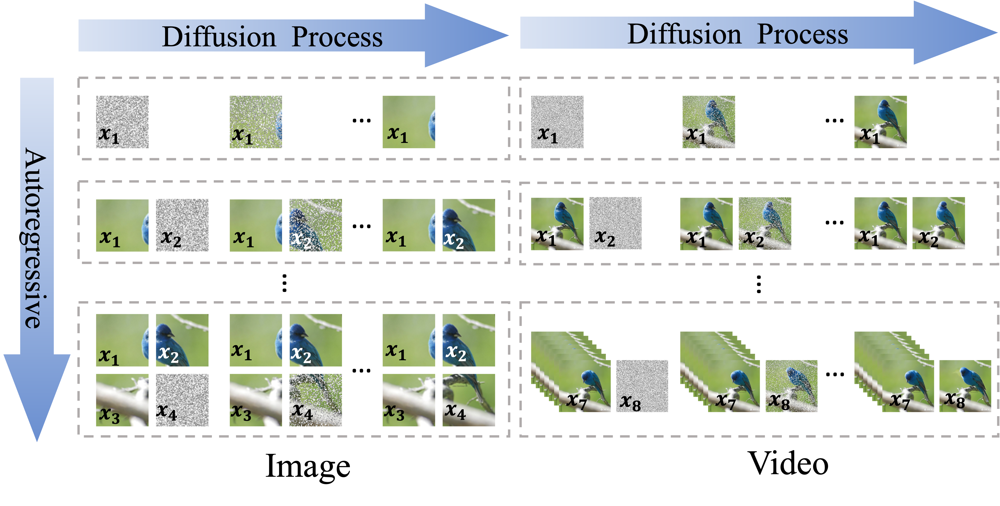
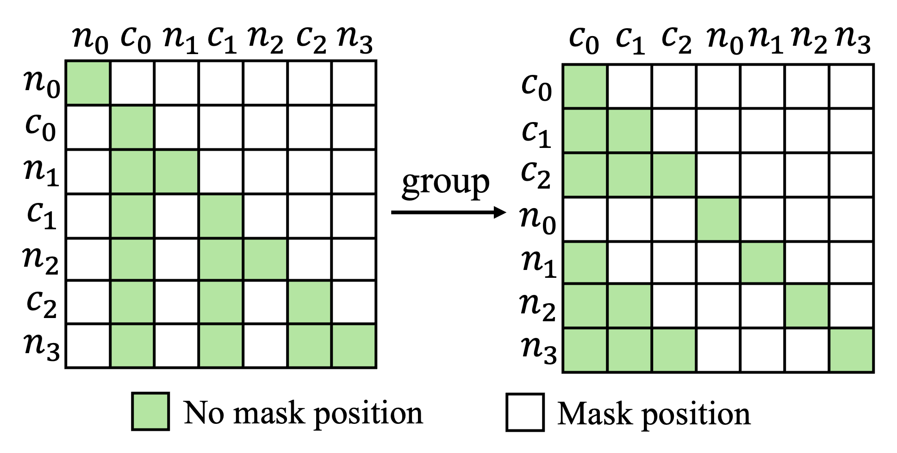
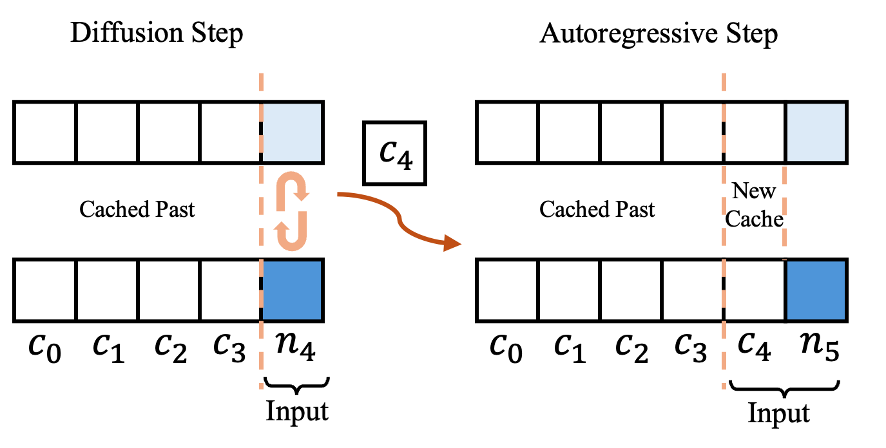
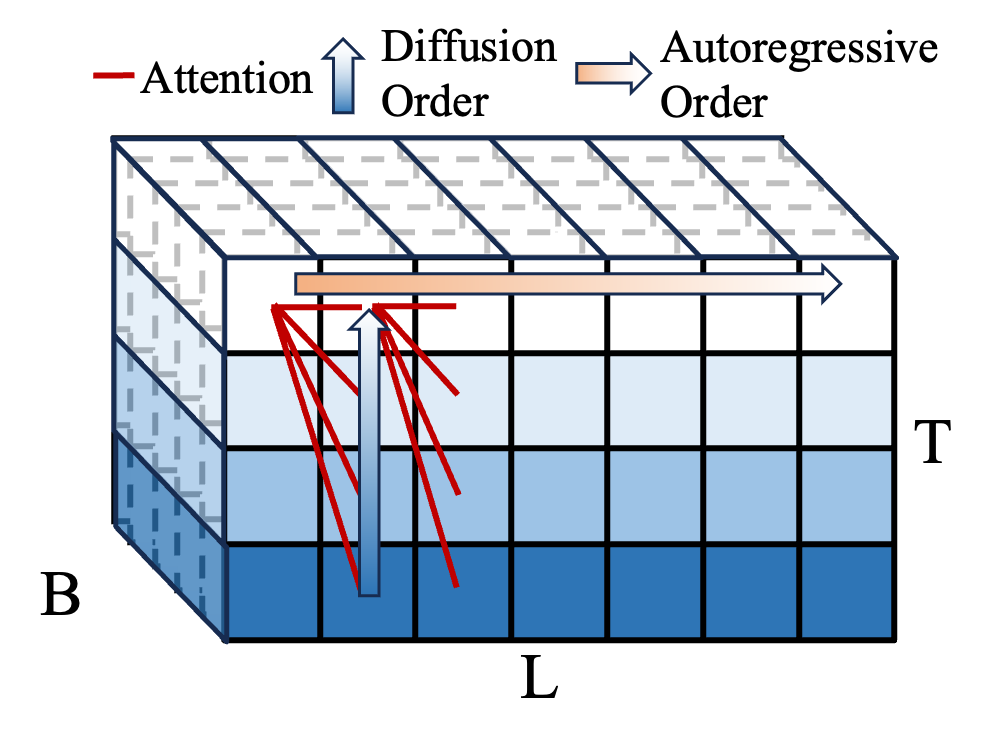

<h1 align="center"> ACDiT: Interpolating Autoregressive Conditional Modeling and Diffusion Transformer
</h1>

This repository contains the official implementation of **ACDiT**, an innovative model combining the strengths of **autoregressive modeling** and **diffusion transformers**. ACDiT introduces a flexible blockwise generation mechanism, achieving superior performance in both image and video generation tasks. 

## Overview

**ACDiT** (**A**utoregressive **C**onditional **Di**ffusion **T**ransformer) interpolates between token-wise autoregressive modeling and full-sequence diffusion by introducing a block-based paradigm. Inherent advantages include:
- Simultaneously learns the causal interdependence across blocks with autoregressive modeling and the non-causal dependence within blocks with diffusion modeling.
- Endowed with clean continuous visual input.
- Makes full use of KV-Cache for flexible autoregressive generation.

The generation process of ACDiT, where pixels in each block are denoised simultaneously conditioned on previously generated clean contexts.

### Skip-Causal Attention Mask (SCAM)
| (a) SCAM for training                        | (b) Inference Process                          | (c) 3D view of ACDiT                            |
|---------------------------------------------|-----------------------------------------------|------------------------------------------------|
|       |        |       |

ACDiT is easy to implement, as simple as adding a Skip-Causal Attention Mask to the current DiT architecture during training, as shown in (a), where each noised block can only attend previous clean blocks and itself. During inference, ACDiT utilizes KV-Cache for efficient autoregressive inference.

## Implementation
To implement the SCAM for both customization and efficiency, we use [FlexAttention](https://pytorch.org/blog/flexattention) provided by [Pytorch 2.5](https://pytorch.org/blog/pytorch2-5/). The training codes and model checkpoints will be released soon.

## Acknowledgements
This code is mainly built upon [DiT](https://github.com/facebookresearch/DiT) repository.

## License

This project is licensed under the MIT License.